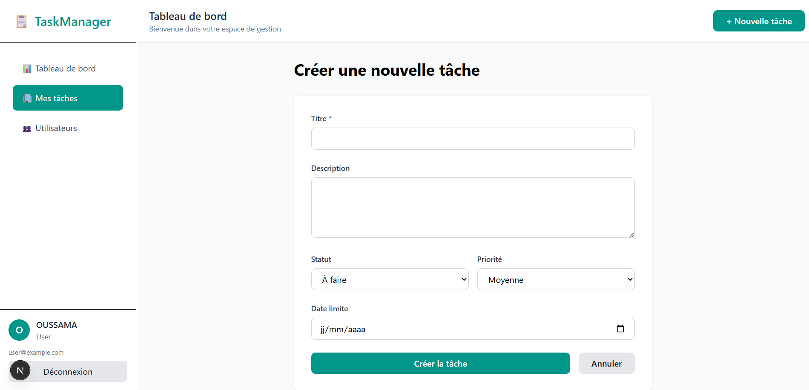

#  TaskManager - Application de Gestion des Tâches

Une application **fullstack moderne** de gestion de tâches construite avec **Next.js 14**, **Prisma**, et **TypeScript**.

##  Features

-  **Authentification sécurisée** - Login/Register avec localStorage
-  **Tableau de bord** - Statistiques et graphiques en temps réel
-  **CRUD Complet** - Créer, lire, modifier, supprimer les tâches
-  **Filtres avancés** - Recherche, statut, priorité, tri
-  **Gestion utilisateurs** - Admin et utilisateurs
-  **Design responsive** - Mobile, tablet, desktop
-  **UI/UX moderne** - Design élégant avec Tailwind CSS
-  **Type-safe** - TypeScript partout
-  **Routes protégées** - Accès sécurisé

##  Screenshots

### Dashboard
```
images/image-1.png
```

### Mes Tâches
```



```

### Authentification
```

```
### Register
```

```

##  Technologies Utilisées

### Frontend
- **Next.js 14** - React framework
- **React 18** - UI library
- **Tailwind CSS** - Styling
- **TypeScript** - Type safety
- **React Hooks** - State management

### Backend
- **Node.js** - Runtime
- **Prisma** - ORM
- **PostgreSQL** - Database (ou votre BD)
- **REST API** - API design

### Hosting
- **Vercel** - Frontend deployment
- **Prisma Cloud** - Database hosting

##  Prerequisites

- Node.js 18+
- npm ou yarn
- PostgreSQL (ou autre BD configurée)

## 🔧 Installation

### 1. Cloner le repo
```bash
git clone https://github.com/oussama-elmouh/task-manager
cd task-manager
```

### 2. Installer les dépendances
```bash
npm install
```

### 3. Configuration des variables d'environnement
```bash
cp .env.example .env.local
```

Modifier `.env.local`:
```
DATABASE_URL="file:./prisma/dev.db"
NEXTAUTH_URL="http://localhost:3000"
NEXTAUTH_SECRET="dev-secret-key-change-in-production"
NEXT_PUBLIC_API_URL="http://localhost:3000/api"
NODE_ENV="development"
```

### 4. Setup de la base de données
```bash
npx prisma migrate dev
npx prisma db seed  # Optional: populate seed data
```

### 5. Lancer le serveur
```bash
npm run dev
```

Ouvrir [http://localhost:3000](http://localhost:3000)

##  Testing

### Credentials de Test
```
Email: user@example.com
Password: password123

Email: admin@taskmanager.com
Password: password123
```

### Tester les Features
-  Créer une nouvelle tâche
-  Modifier une tâche existante
-  Marquer comme terminée
-  Filtrer par statut/priorité
-  Voir le tableau de bord
-  Gérer les utilisateurs (admin)

##  Structure du Projet

```
task-manager/
├── src/
│   ├── app/
│   │   ├── (auth)/
│   │   │   ├── login/page.tsx
│   │   │   └── register/page.tsx
│   │   ├── (dashboard)/
│   │   │   ├── layout.tsx
│   │   │   ├── dashboard/page.tsx
│   │   │   ├── tasks/
│   │   │   │   ├── page.tsx
│   │   │   │   ├── [id]/edit/page.tsx
│   │   │   │   └── create/page.tsx
│   │   │   └── users/page.tsx
│   │   ├── api/
│   │   │   ├── auth/
│   │   │   │   ├── login/route.ts
│   │   │   │   └── register/route.ts
│   │   │   └── tasks/
│   │   │       ├── route.ts
│   │   │       └── [id]/route.ts
│   │   ├── layout.tsx
│   │   └── page.tsx
│   ├── lib/
│   │   ├── auth.ts
│   │   ├── authContext.tsx
│   │   └── prisma.ts
│   ├── components/
│   │   ├── Sidebar.tsx
│   │   └── Header.tsx
│   └── prisma/
│       └── schema.prisma
├── .env.example
├── package.json
├── tsconfig.json
└── README.md
```

##  Architecture

### Client-Side
- Next.js App Router pour routing
- React Context pour state management
- TypeScript pour type safety

### Server-Side
- REST API endpoints
- Prisma pour database queries
- Authentication avec localStorage

##  Sécurité

- ✅Routes protégées par authentification
- ✅Validation des données côté serveur
- ✅CORS configuré
- ✅Type checking avec TypeScript

##  Ressources Principales

- [Next.js Documentation](https://nextjs.org/docs)
- [Prisma Documentation](https://www.prisma.io/docs)
- [Tailwind CSS](https://tailwindcss.com)
- [TypeScript](https://www.typescriptlang.org)


## 📈 Performance

- ✅ Optimisation d'images
- ✅ Code splitting automatique
- ✅ Lazy loading
- ✅ Caching des données

## 🤝 Contribuer

Les contributions sont les bienvenues!

1. Fork le projet
2. Créer une branche (`git checkout -b feature/AmazingFeature`)
3. Commit vos changements (`git commit -m 'Add some AmazingFeature'`)
4. Push sur la branche (`git push origin feature/AmazingFeature`)
5. Ouvrir une Pull Request


##  Support

Pour les questions ou problèmes, ouvrir une issue sur GitHub.

##  Remerciements

- Next.js team
- Prisma team
- Vercel
- Tous les contributeurs

---

**Dernière mise à jour:08 Novembre 2025
**Version:** 1.0.0
 

